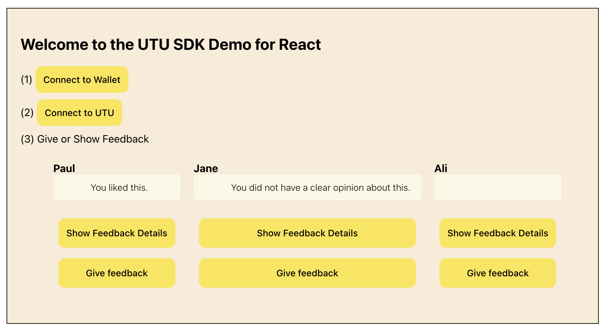

# UTU Trust SDK React Example Dapp

This example shows you how to integrate with the UTU Trust SDK from within a React web dapp.  

## What is the UTU Trust Network?

The UTU Trust Network allows wallet users to:

* Give and Receive Feedback (signal) on certain assets such as web page addresses, contract
    addresses, products services

* Endorse comments to give them more weight by spending UTU coin.

There are a few components in this:

```
(i)   Connecting to your Wallet using "Wallet Connect"
(ii)  Connecting to the UTU backend
(iii) Give UTU feedback (signal) on an asset. Optionally Endorse the comment by spending UTU coin.
(iv)  Get UTU feedback (signal) on an asset
```

What is worthy of note is that Feedback for a certain asset can come from people in the social 
network of a certain user.  The idea is one can trust comments from users in one's network more
than comments from total strangers.

Consider the example of integrating the UTU SDK into a chrome extension:

The extension could warn the user with feedback from the user's network that the web domain they 
are on is a malicious domain which may try and empty and steal the crypto in their wallet if they 
click on a button.


## Steps to get this example working

### Step 1: Install Metamask

Go to:

```
https://metamask.io/download/
```

Download and install MetaMask into your Chrome Browser


### Step 2: Clone this example

```
cd ~
mkdir workspace
cd workspace
clone https://gitlab.com/ututrust/api-sdk/utu-trust-sdk-react-example-dapp.git
cd utu-trust-sdk-react-example-dapp
```

### Step 3: Go to Wallet Connect and sign up and get your project id

Go to 

```
https://walletconnect.com/
```

Read docs - familiarise yourself on what wallet connect is about.

Then go to:

```
https://cloud.walletconnect.com/sign-in
```

Sign up with your email address.  Create a project and get your Project ID.

A Project ID looks like:

    7fcb9eef629acf7a853f1ca68b984e7d


### Step 4: Add the Project ID to the code

Go to this file:

```
utu-trust-sdk-react-example-dapp2/src/index.tsx
```

Find projectId and replace it with the project id you created in Step 2

### Step 5:  Build and run

```
npm install
npm run start
```

Access the example app on:

```
http://localhost:3000/
```

### Step 6: Screenshot of Application

The app looks like:

  


### Step 7: End User Instructions

First of all:

* Click the "Connect to Wallet" Button and connect to your MetaMask wallet
* Click the "Connect to UTU" Button.  The MetaMask popup will show again to login to UTU.

Behind the scenes the connect to UTU returns a JWT token that is later used everytime the code calls the UTU Trush SDK backend APIs.

Then:

* Click the "Give Feedback" button of Paul and write a comment
* Click the "Show Feedback Details" button of Paul and see the comment.


## Explanation of Tag attributes

In offers.js you will see code like:

```
@todo Tags
```

### target-uuid  

This is the universal unique identifier of the asset we want to comment on.  It could be something 
like the id of a product, service or a domain.  It is something which has a unique id which can be 
commented on.

### source-uuid 

This is the universal unique identifier of the user / entity that is making a comment.  It can be 
something unique like a wallet address contract id.  When showing feedback it is also the unique 
identifier of the user / entity that is wanting to see comments for a certain asset.  The reason we 
pass this id when we want to see feedback is that we look for comments given by users / entites that
are in that user's / entity's network.  For example a user may be connected to other people in 
telegram, twitter and other social networks.

### api-url

This points to the UTU environment (prod / test) where we want to give or get the feedback from.

### transaction-id

This is a reference the user can use for any reason they see fit.  It can be for example used
to tag a group of assets.

### target=uuids

@todo

### target-type 

This is the kind of asset one is commenting on.  For example if you are commenting on a certain
web page you may wish the target-type to be a domain.  Note you can add any description here.


## Explanation of Wallet Connect Code

@todo

## Explanation of SDK Code

@todo

